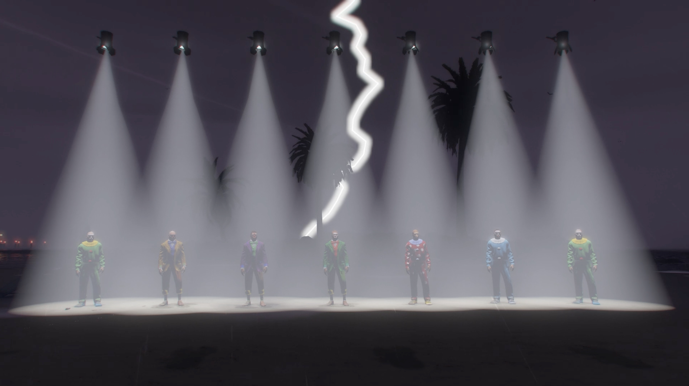

# Piano of the Dead
by 2girls1comp

A mod for GTA V that turns the game into a piano of NPC screams.

About:

A mod for GTA V that turns the game into a music instrument. The GTA V Piano of the Dead comprises exclusively of assets from the game, including screams from the GTA V database which have been mapped to the 7 tones of the C4 octave.

The GTA V Piano of the Dead is open to all musicians and composers who would like to work with it in any capacity. Interested parties are welcome to send a request via email to 0_o@2girls1comp.xyz

Demo:

https://youtu.be/vGVazL3JfdA

Installation:
- Copy "PianoOfTheDead.dll" and the "tones" folder in your scripts folder (if you don't have one create it) in your GTA V root folder

Instructions:
- Shift + Y to spawn the Piano of the Dead
- Use the following keys to play the Piano of the Dead when it's active: D, F, G, H, J, K, L
- Shift + Z to despawn the Piano of the Dead

Requirements:
- [Script Hook V](http://www.dev-c.com/gtav/scripthookv/)
- [Script Hook V Dot Net](https://github.com/crosire/scripthookvdotnet/releases)

